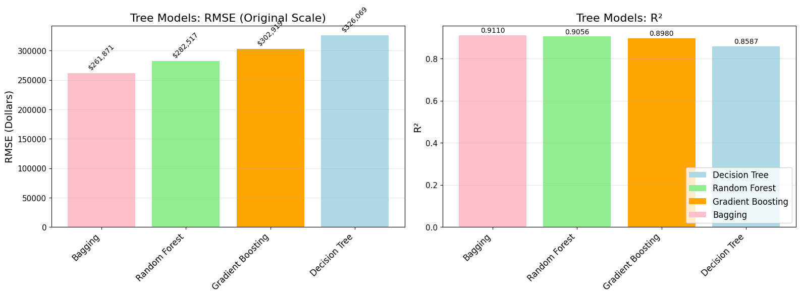

# Aircraft Price Analysis - Statistical Learning Project

A comprehensive analysis of commercial aircraft pricing using statistical learning methods, developed for the Statistical Learning course at University of Bergamo.


## 📊 Project Overview

This project analyzes a dataset of 497 commercial aircraft to predict prices using various statistical learning techniques. We explore the relationship between aircraft technical specifications and market pricing, addressing the need for data-driven valuation models in the aviation industry.

**Authors:** Amin Borqal, Filippo Bolis  
**Course:** Statistical Learning - University of Bergamo (Prof. Francesco Finazzi)  
**Academic Year:** 2024/2025

## 🎯 Objectives

- **Q1:** Which models achieve the highest accuracy in aircraft price prediction?
- **Q2:** Which aircraft features drive value, and how consistent are they across models?
- **Q3:** Are nonlinear effects and feature interactions relevant for pricing?
- **Q4:** Which methods offer the best trade-off between accuracy, interpretability, and efficiency?

## 📈 Dataset

- **Source:** Kaggle Aircraft Price Analysis & Prediction Dataset
- **Size:** 497 observations after cleaning
- **Features:** 14 variables (12 numerical, 2 categorical)
- **Target:** Aircraft price in USD (range: $50K - $15M)
- **Key Variables:** engine_power, max_speed, cruise_speed, fuel_tank, range, wing_span, empty_weight

### Data Preprocessing & Distributions
The original features showed significant skewness, requiring log transformation for better model performance:


## 🔧 Methods Implemented

### Linear Models
- **Ordinary Least Squares (OLS)** - Baseline regression
- **Ridge Regression** - L2 regularization
- **Lasso Regression** - L1 regularization with feature selection

### Non-Linear Models
- **Generalized Additive Models (GAM)** - Smoothing splines
- **Polynomial Regression** - Various degrees with ANOVA testing
- **B-Splines & Natural Splines** - Flexible curve fitting

### Tree-Based Methods
- **Decision Trees** - Cost complexity pruning
- **Random Forest** - Bootstrap aggregating with feature sampling
- **Gradient Boosting** - Sequential error correction
- **Bagging (Extra Trees)** - Bootstrap aggregating

## 🏆 Key Results

| Model | RMSE (USD) | R² | Notes |
|-------|------------|----|----- |
| **Bagging (Extra Trees)** | **$261,871** | **0.9110** | Best performance |
| Random Forest | $282,517 | 0.9056 | High accuracy + interpretability |
| Gradient Boosting | $302,919 | 0.8980 | Good performance |
| GAM | $361,000 | 0.8920 | Best interpretability trade-off |
| Ridge | $370,000 | 0.8495 | Stable linear model |
| Lasso | $376,000 | 0.8494 | Feature selection |
| Linear Regression | $389,179 | 0.8421 | Baseline |

### Model Performance Visualization


## 📋 Key Findings

- **Best Predictor:** Bagging (Extra Trees) achieves lowest RMSE with highest R²
- **Top Features:** cruise_speed, max_speed, fuel_tank consistently important across models
- **Interpretability vs Accuracy:** GAM offers best balance between performance and explainability
- **Feature Selection:** Lasso eliminates non-significant features while maintaining performance
- **Log Transformation:** Critical preprocessing step that improved all models

### Feature Importance Analysis
Consistent feature importance across different model types reveals key value drivers:


### GAM Partial Dependence Analysis
Generalized Additive Models reveal non-linear relationships between features and aircraft prices:


## 🚀 Project Structure

```
├── ULTIMAFINALE/                  # Final notebooks (English)
│   ├── TreeModels.ipynb          # Tree-based methods analysis
│   └── NonLinearModels3.ipynb    # Non-linear models analysis
├── LaTeX/                        # Documentation
│   ├── paper_complete.tex        # Full technical paper
│   ├── presentation_aircraft_analysis.tex  # Presentation slides
│   └── images/                   # Generated plots and figures
├── AircraftPRICE project/        # Development notebooks
└── Data/                         # Processed datasets
```

## 🛠️ Technical Implementation

- **Language:** Python
- **Key Libraries:** scikit-learn, statsmodels, PyGAM, ISLP
- **Validation:** 10-fold cross-validation with shuffling
- **Preprocessing:** Log transformation for skewed variables
- **Feature Engineering:** Polynomial terms, spline bases
- **Model Selection:** Grid search with cross-validation

### Model Validation & Residual Analysis
Comprehensive residual analysis ensures model validity:


## 📖 References

- James, G., Witten, D., Hastie, T., Tibshirani, R., & Taylor, J. (2023). *An Introduction to Statistical Learning: with Applications in Python*. Springer Cham.
- Course materials from Prof. Francesco Finazzi, University of Bergamo

## 🎓 Academic Context

This project demonstrates practical application of statistical learning concepts from ISLR, including:
- Bias-variance tradeoff analysis
- Regularization techniques (Ridge/Lasso)
- Non-parametric methods (GAM, splines)
- Ensemble methods (bagging, boosting)
- Model validation and selection procedures
