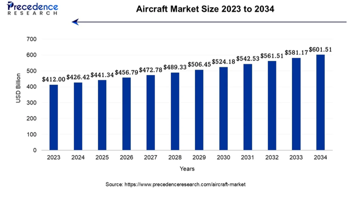
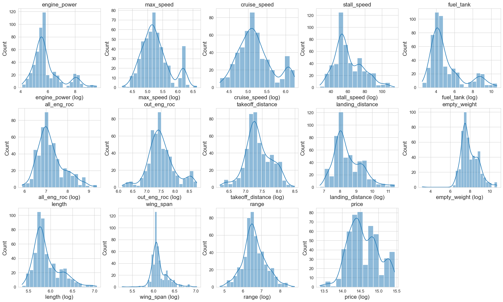
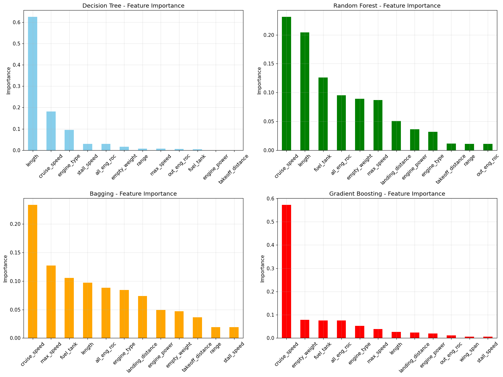
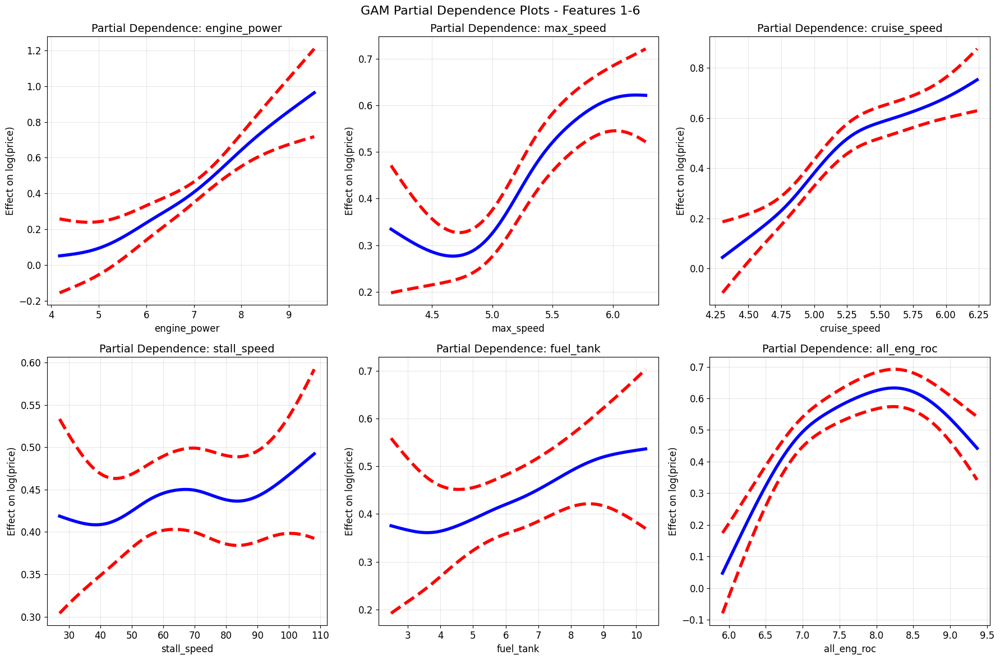
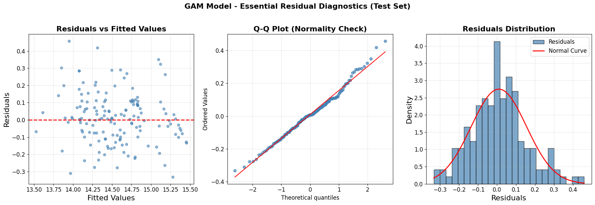

# Aircraft Price Analysis - Statistical Learning Project

*A comprehensive statistical modeling approach to commercial aircraft valuation*

**Authors:** Amin Borqal, Filippo Bolis  
**Course:** Statistical Learning - University of Bergamo (Prof. Francesco Finazzi)  
**Academic Year:** 2024/2025

---

## 🌍 Market Context

The global aircraft market was valued at **USD 426.42 billion** in 2024 and is projected to reach **USD 601.51 billion** by 2034. Traditional valuation methods struggle with new technologies, regulatory uncertainty, and market volatility.

<div align="center">

</div>

> *"Having a reliable data-based pricing model would be a game changer."* — Aviation Week, 2025

---

## 🎯 Research Questions

- **Q1:** Which models achieve the highest accuracy in aircraft price prediction?
- **Q2:** Which aircraft features drive value, and how consistent are they across models?
- **Q3:** Are nonlinear effects and feature interactions relevant for pricing?
- **Q4:** Which methods offer the best trade-off between accuracy, interpretability, and efficiency?

---

## 📊 Dataset Overview

**Source:** Kaggle Aircraft Price Analysis & Prediction Dataset  
**Final Size:** 497 observations (10 removed due to missing prices)  
**Variables:** 14 total (12 numerical, 2 categorical)  
**Target:** Aircraft price in USD (range: $50K - $15M)

### Key Features
- **Performance:** `engine_power`, `max_speed`, `cruise_speed`, `stall_speed`
- **Capacity:** `fuel_tank`, `range`, `empty_weight`
- **Dimensions:** `length`, `wing_span`
- **Operations:** `all_eng_roc`, `one_eng_roc`, `takeoff_distance`, `landing_distance`
- **Categories:** `model_name`, `engine_type`

### Data Preprocessing

Original features showed significant skewness requiring **log transformation** for all numerical variables:

<div align="center">

<p><em>Feature distributions before and after log transformation</em></p>
</div>

---

## 🔬 Methodology

We implemented and compared multiple statistical learning approaches, each with rigorous hyperparameter tuning via cross-validation:

### 1. Linear Models
- **OLS Regression** - Baseline with all features
- **Ridge Regression** - L2 regularization (α = 0.7009)
- **Lasso Regression** - L1 regularization with feature selection (α = 0.0007)

### 2. Non-Linear Models
- **Generalized Additive Models (GAM)** - Smoothing splines for each feature
- **Polynomial Regression** - ANOVA-based degree selection
- **Regression Splines** - B-splines and Natural splines

### 3. Tree-Based Methods
- **Decision Trees** - Cost complexity pruning
- **Random Forest** - Bootstrap aggregating with feature sampling
- **Gradient Boosting** - Sequential error correction
- **Bagging (Extra Trees)** - Bootstrap aggregating

---

## 🏆 Results Summary

| Model | RMSE (USD) | R² | Key Characteristics |
|-------|------------|----|--------------------|
| **Bagging (Extra Trees)** | **$261,871** | **0.9110** | 🥇 Best overall performance |
| Random Forest | $282,517 | 0.9056 | High accuracy + some interpretability |
| Gradient Boosting | $302,919 | 0.8980 | Good sequential learning |
| GAM | $361,000 | 0.8920 | **Best interpretability trade-off** |
| Ridge | $370,000 | 0.8495 | Stable, uses all features |
| Lasso | $376,000 | 0.8494 | Feature selection (12/13 features) |
| Linear Regression | $389,179 | 0.8421 | Baseline reference |

---

## 🔍 Key Insights

### Feature Importance Analysis
Consistent patterns emerge across different model types:

<div align="center">

<p><em>Feature importance rankings across tree-based models</em></p>
</div>

**Top Value Drivers:**
1. **cruise_speed** - Most consistent predictor across all models
2. **max_speed** - Strong linear and non-linear effects
3. **fuel_tank** - Capacity indicator with diminishing returns
4. **wing_span** - Size proxy with interaction effects

### GAM Non-Linear Relationships

Generalized Additive Models reveal complex non-linear patterns:

<div align="center">

<p><em>GAM partial dependence plots showing non-linear feature effects</em></p>
</div>

**Key Non-Linear Patterns:**
- **cruise_speed**: Steep increases with diminishing returns at high speeds
- **fuel_tank**: Logarithmic relationship with capacity
- **engine_power**: Threshold effects at certain power levels

### Model Validation

Comprehensive residual analysis confirms model validity:

<div align="center">

<p><em>GAM residual analysis: Q-Q plot and distribution show approximate normality</em></p>
</div>

---

## 💡 Practical Recommendations

### Model Selection Guide

| Use Case | Recommended Model | Reasoning |
|----------|------------------|-----------|
| **Maximum Accuracy** | Bagging (Extra Trees) | Lowest RMSE, highest R² |
| **Interpretability** | GAM | Clear feature effects, good accuracy |
| **Feature Selection** | Lasso | Automatic variable selection |
| **Robustness** | Ridge | Stable across different datasets |
| **Baseline** | Linear Regression | Simple, fast, interpretable |

### Implementation Notes
- **Preprocessing:** Log transformation is **critical** for performance
- **Validation:** 10-fold CV with shuffling provides robust estimates
- **Feature Engineering:** Consider interaction terms for tree methods
- **Deployment:** GAM offers best production balance of accuracy and explainability

---

## 📁 Project Structure

```
StatisticalLearningProject/
├── ULTIMAFINALE/                    # 🎯 Final Analysis (English)
│   ├── TreeModels.ipynb            # Tree-based methods
│   └── NonLinearModels3.ipynb      # GAM, splines, polynomials
├── LaTeX/                          # 📄 Documentation
│   ├── presentation_aircraft_analysis.tex
│   ├── paper_complete.tex
│   └── images/                     # Generated visualizations
├── AircraftPRICE project/          # 🔬 Development notebooks
└── Data/                          # 📊 Processed datasets
```

---

## 🛠️ Technical Stack

- **Language:** Python 3.x
- **Core Libraries:** scikit-learn, statsmodels, PyGAM, ISLP
- **Validation:** K-fold cross-validation with grid search
- **Visualization:** matplotlib, seaborn
- **Statistical Methods:** Following "Introduction to Statistical Learning" (ISLR)

---

## 🎓 Academic References

- James, G., Witten, D., Hastie, T., Tibshirani, R., & Taylor, J. (2023). *An Introduction to Statistical Learning: with Applications in Python*. Springer Cham.
- Course materials from Prof. Francesco Finazzi, University of Bergamo
- Kaggle Dataset: Aircraft Price Analysis & Prediction

---

## 🚀 Future Work

- Incorporate time-series effects (aircraft age, market trends)
- Add external economic indicators (fuel prices, interest rates)
- Explore deep learning approaches for complex interactions
- Develop real-time pricing API for industry deployment

